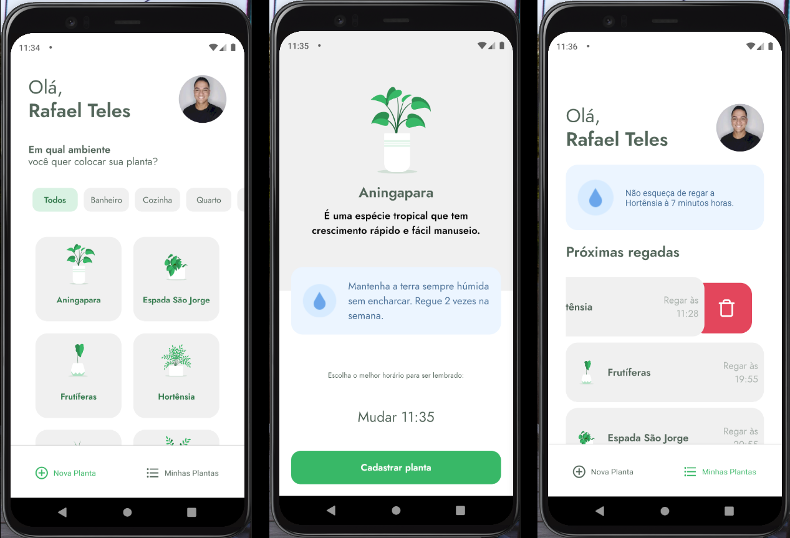
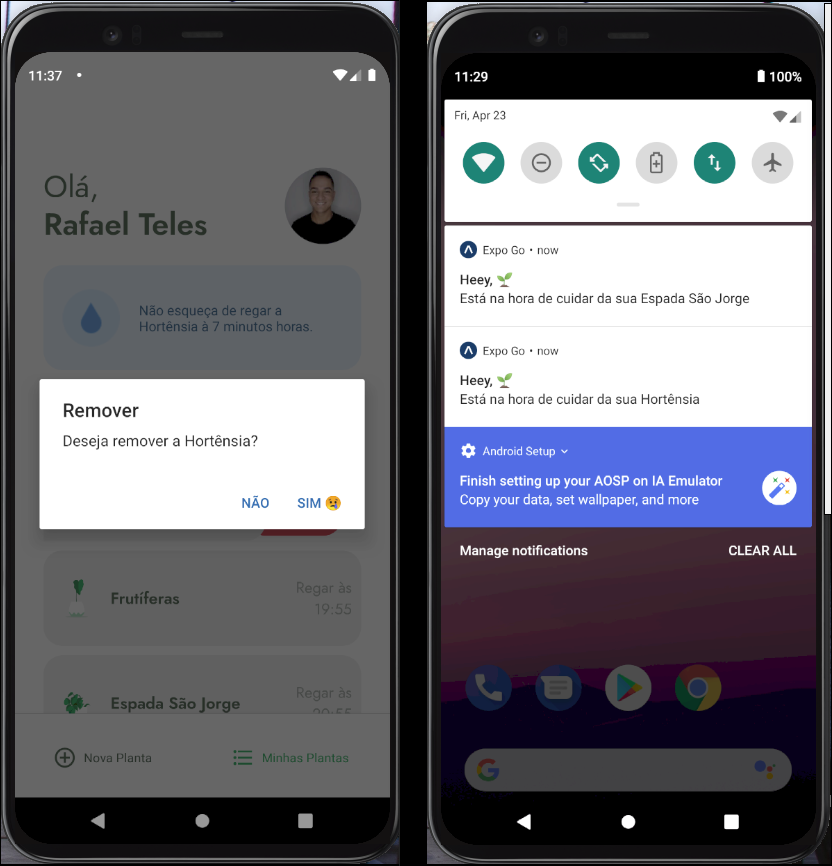

# Resultado

<h1 align="center">  
  APP - PlantManager 🌱
  <br /> <br />
  
  <br /> <br />
  
  <br /> <br />
  
</h1>

# `Indice` 📇

<a href="#React-Native">1. React-Native</a> <br />
<a href="#Tecnologias-utilizadas">2. Tecnologias utilizadas</a> <br />
<a href="#Como-baixar-o-projeto">3. Como baixar o projeto</a>

## React-Native

Esse é um aplicativo que desenvolvemos no evento da **rocketseat** na semana do **NLW**.

Criamos o app **PlantManager** para você gerenciar o cadastro de suas plantas e os horários que cada planta precisa ser regada.

Foi implementado usando o **expo** e com **expo-notifications**, para lembrar você de regar a sua plantinha 🌱 no horário certo!!!

---

<br /><br />

## 💻 Tecnologias utilizadas 💻

- React-Native
- Axios
- TypeScript
- Animated (Animação do react-native)
- react-navigation/native
- date-fns
- react-native-vector-icons
- expo-fonts
- lottie-react-native
- json-server
- react-native-iphone-x-helper
- react-native-svg

---

## 📽️ Como baixar o projeto 📽️

```bash

  # Clonar o repositório
  $ git clone https://github.com/DevTeles/plantManager.git

  # Entrar no diretório
  $ cd plantManager

  # Instalar as dependências
  $ yarn

  # rodar API json-server
  $ yarn server

  # Iniciar o projeto
  $ expo start

```

<br /><br />

# 🚀🚀🚀🚀

# Codigos dos desafios

#missaoespacial <br />
#embuscadoproximonivel<br />
#astronautas<br />
#universoinfinito<br />
#missaocumprida

<br />

## Desenvolvido por **Rafael Teles Vital**
